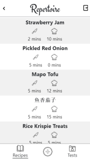
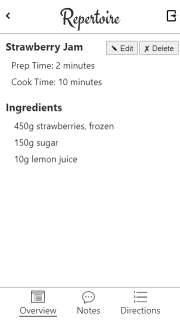
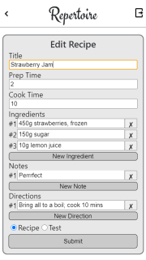
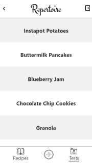
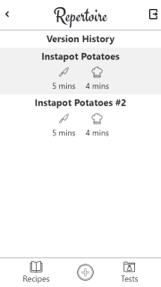
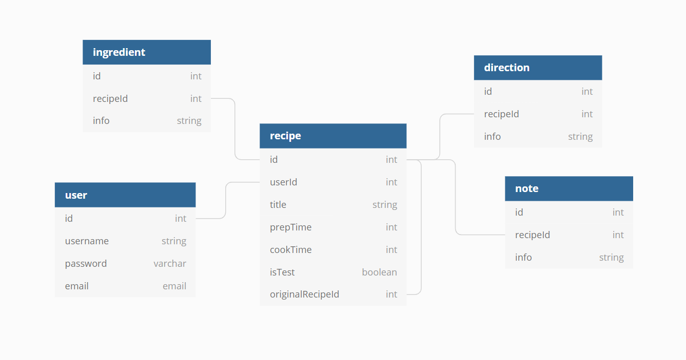

<h1>Repertoire</h1>

An app to combine your recipe journal and cookbook into one! Repertoire is a recipe manager that differentiates finalized recipes from test recipes to help easily track the progression of a recipe until it's finalized. Users can also create multiple versions of the same test recipe to view differences or review notes between versions.

  
  
  

  
  

 

#### Key Features:

- Recipe Cards - View a recipe's ingredients, notes, and directions.
- Recipe Tracking - Make and save alterations during recipe testing.
  - Version History - All versions conveniently saved in one location.
- Cookbook - Finalized recipes are moved to the Recipes tab.

#### To Run

1. From this repo's home page, click the green **Code** button.
2. On the dropdown menu, click the **Use SSH** link and copy the provided URL.
3. In the terminal, execute **git clone _paste SSH url here_**.
4. Cd into **repertoire/api** and create a **Database.json** file. Then, execute **json-server -p 8088 data.json**.
5. Cd into **repertoire/modules** and open **DataManager.js**. Change the **remoteURL** variable to your local server's url and save.
6. From the root directory, execute **npm start**.

#### Tech Used

- Javascript
- ReactJS
- JSON server
- CSS

#### ERD

#### Contributors

Tanner Brainard
